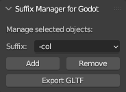

# BLENDER GODOT SUFFIX MANAGER

Thanks for checking out this simple but handy tool for managing Blender object names when exporting to Godot.

**OVERVIEW:**

When exporting, a common use case is to have Godot automatically create a collision mesh for each object. 

You can achieve this, manually, by adding the "-col" suffix to the end of each object name in Blender. But, what if you have 10, 20 or even 100 objects? This is where the Suffix Manager is really handy.

Select the objects you want to rename and click a simple button to add the suffix to all selected objects at once!

The "Suffix Manager" tab in the 3D Viewport Sidebar contains a "Suffix" pulldown menu along with "Add" and "Remove" buttons. There is also an "Export GLTF" button to save you from having to go to the Export menu.

Choose a suffix from the convenient list. "-col" is selected by default. Hover over suffix names for more detailed descriptions.

With Blender Godot Suffix Manager, you'll quickly and easily rename your Blender objects for export to Godot.

**HOW TO INSTALL:**

Click the green "Code" button at the top center of the page and choose "Download ZIP". Alternatively, Navigate to "Releases>Tags" in the right-hand panel and download the zip file for the latest tag. **THEN**, extract "godot_suffix_manager.py" to your desktop. Next, open Blender, go to "Settings>Add-ons" and...

In older versions of Blender, simply click "Install" and install the file from your desktop.

In newer Blender versions, click the chevron arrow pulldown menu in the upper right corner of the Add-ons panel and choose "Install from disk". Then, install the file from your desktop.

Finally, enable the checkbox next to the newly installed addon in the Add-ons panel.

**HOW TO ADD SUFFIXES:**

Select the target objects, select the desired suffix and click "Add". This will add the suffix to the objects. If an object has a different suffix, then that suffix will be removed and replaced with the new one.

**HOW TO REMOVE SUFFIXES:**

To remove suffixes, select the target objects and click "Remove". 

**LIMITATIONS:**

Tool doesn't operate on hidden objects. Make them visible, first, before renaming them.

Tool operates on most objects regardless of whether they contain a mesh. Although, it doesn't rename collections. At any rate, be mindful of what you select.
